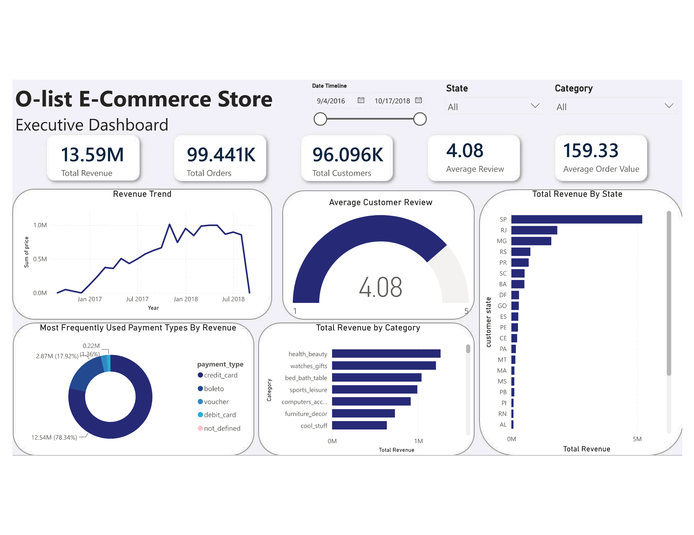
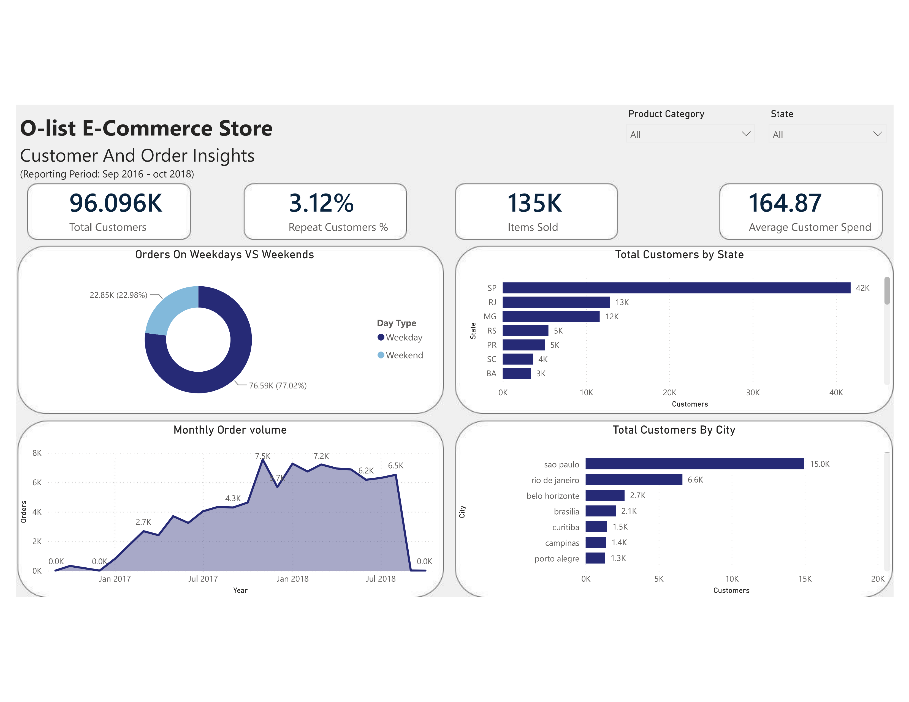

# Olist E-Commerce Analysis


## Overview

This project analyzes the **Olist Brazilian E-Commerce dataset** using **SQL and Power BI** to evaluate sales performance, order trends, product categories, payment behavior, and customer purchasing patterns.

The project follows an end-to-end data analysis workflow:

**Data Quality Checks → SQL EDA → KPI Analysis → Power BI Data Modeling → Dashboard → Business Insights**

---

## Business Questions

The analysis focuses on the following business questions:

* What is Olist's total revenue?
* How does revenue change over time?
* How many orders were placed?
* Which product categories generate the most sales?
* What is the average order value (AOV)?
* How does AOV vary by payment method?
* How does order value vary across product categories?
* What can customer segmentation tell us about purchasing behavior?

---

## Dataset

The project uses the **Brazilian E-Commerce Public Dataset by Olist**.

The dataset contains information about:

* Orders
* Customers
* Products
* Sellers
* Payments
* Reviews
* Order items
* Geolocation
* Product categories

The original dataset is not included in this repository.

---

## Tools & Technologies

* **SQL / MySQL** — Data exploration and business analysis
* **Power BI** — Data visualization and dashboard development
* **DAX** — Measures and customer segmentation
* **GitHub** — Project documentation and version control

---

## Repository Structure

```text
olist-ecommerce-analysis/
│
├── README.md
│
├── sql/
│   ├── 01_data_quality.sql
│   └── 02_business_analysis.sql
│
├── dashboard/
│   └── olist_dashboard.pbix
│
├── images/
│   ├── dashboard_page_1.png
│   └── dashboard_page_2.png
│
└── data/
    └── README.md
```

### `sql/`

Contains the SQL analysis used to explore the Olist dataset and answer business questions.

### `dashboard/`

Contains the Power BI dashboard file.

### `images/`

Contains screenshots of the Power BI dashboard for viewing directly from GitHub.

### `data/`

Contains information about the dataset and instructions for obtaining it.

---

# SQL Analysis

The SQL analysis was divided into data quality checks and business analysis.

## Data Quality

Initial checks were performed to identify potential inconsistencies in the dataset, including checking customer city and state combinations.

## Sales Performance

The analysis calculates:

* Total revenue
* Revenue by quarter
* Revenue by month
* Total number of orders
* Monthly order volume

## Product Analysis

Product performance was analyzed by calculating sales across product categories.

## Payment & Order Value Analysis

The analysis also examines:

* Overall Average Order Value (AOV)
* AOV by payment method
* AOV by product category

The SQL analysis demonstrates the use of:

* `SELECT`
* `WHERE`
* `JOIN`
* `GROUP BY`
* `ORDER BY`
* Aggregate functions
* Date functions
* CTEs
* Multi-table joins

---

# Power BI Dashboard

The Power BI report contains two pages designed to provide an overview of Olist's business performance and customer behavior.

## Page 1 — Sales Overview

The first page focuses on overall sales performance.

It includes metrics and visualizations covering:

* Total revenue
* Total orders
* Average Order Value
* Revenue trends
* Order trends
* Product category performance

### Dashboard Preview



---

## Page 2 — Customer & Product Analysis

The second page focuses on customer and product-level analysis.

It includes:

* Customer segmentation
* Customer purchasing behavior
* Product/category performance
* Payment behavior
* Additional business KPIs

### Dashboard Preview



---

# Key Insights

The analysis identified several important patterns in Olist's e-commerce performance.

### Sales

Revenue and order volume vary over time, allowing periods of stronger and weaker business performance to be identified.

### Product Categories

Sales are concentrated among certain product categories, with some categories generating substantially more revenue than others.

### Customer Segmentation

Customer segmentation highlights differences between new, returning, loyal, and at-risk customers.

### Payment Behavior

Average order value varies across payment methods, providing insight into differences in customer purchasing behavior.

> Specific metrics and findings are presented in the Power BI dashboard.

---

# Skills Demonstrated

## SQL

* Relational data analysis
* Multi-table joins
* Aggregations
* Date-based analysis
* CTEs
* Data quality checks
* KPI calculations
* Business-oriented querying

## Power BI

* Data modeling
* DAX measures
* KPI cards
* Time-series analysis
* Category analysis
* Customer segmentation
* Dashboard design

## Data Analysis

* Translating business questions into SQL queries
* Exploring trends and patterns
* Calculating business KPIs
* Communicating findings through data visualization

---

# Project Workflow

```text
Olist Dataset
      ↓
Data Quality Checks
      ↓
SQL Exploratory Data Analysis
      ↓
Business KPI Analysis
      ↓
Power BI Data Model
      ↓
DAX Measures
      ↓
Interactive Dashboard
      ↓
Business Insights
```

---

# How to Reproduce

1. Obtain the Olist Brazilian E-Commerce dataset.
2. Import the dataset tables into MySQL.
3. Run the SQL scripts located in the `sql/` folder.
4. Open `olist_dashboard.pbix` from the `dashboard/` folder.
5. Update the Power BI data source if required.
6. Refresh the Power BI report.

---

# Conclusion

This project demonstrates an end-to-end data analysis workflow using **SQL and Power BI**, from exploring relational e-commerce data and calculating business KPIs to creating an interactive dashboard and communicating business insights.
